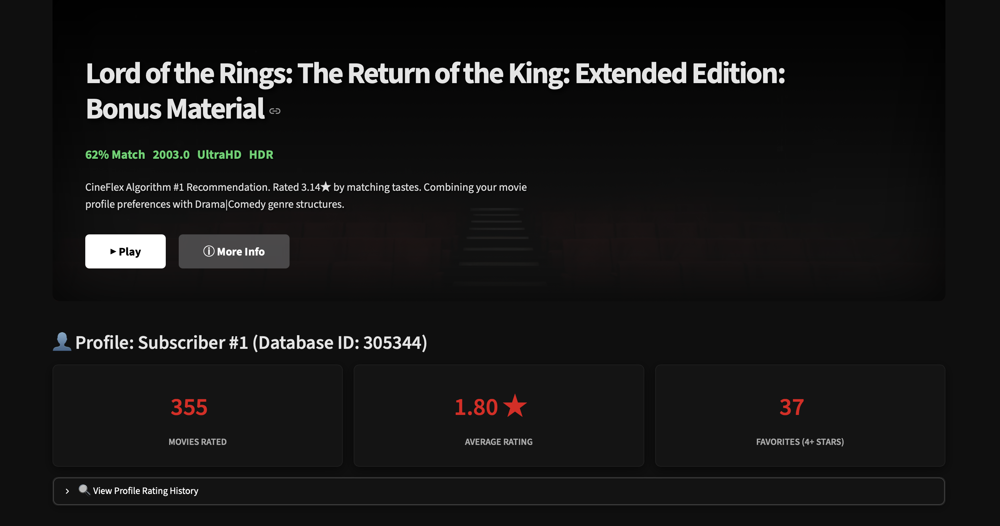

# Cineflex — Movie Recommendation Engine

> Submission for **CULT Open Projects 2026** · IIT Roorkee  
> Built by **Anubhav** (24124005)

A personalized movie recommendation system built on the **Netflix Prize Dataset**, comparing Matrix Factorization (SVD) and User-Based Collaborative Filtering (KNN) — complete with an interactive Streamlit dashboard styled after a real streaming platform.



---

## What is Cineflex?

Cineflex is a full recommendation pipeline — from raw data ingestion and EDA, through model training and evaluation, to a Netflix-themed web dashboard where you can explore recommendations in real time.

The core question it answers: *given 100 million sparse ratings from 480,000 users across 17,770 movies, can a latent factor model learn taste well enough to surface films you'd actually enjoy?*

---

## Results

| Model | RMSE ↓ | MAP@10 ↑ | Train Time | Prediction Time |
|---|---|---|---|---|
| SVD (Matrix Factorization) | **0.9307** | **73.59%** | 2.01s | 1.29s |
| User-Based KNN | 0.9838 | 70.67% | 220.55s | 93.50s |

SVD wins on every dimension — more accurate, better ranking quality, and ~70× faster at prediction time. KNN's cosine similarity matrix scales quadratically with users, making it impractical at real Netflix scale.

> **MAP@10 methodology**: a movie is considered relevant if its true rating ≥ 3.5. Top-10 recommendations are generated per user from unseen movies only. Train/test split is 80/20 random stratified by user.

---

## Features

- **Personalized Recommendations** — SVD + KNN hybrid with adjustable blend weight
- **Cold-Start Onboarding** — genre preference quiz that projects new users into SVD latent space
- **Explainable KNN** — traces exactly which neighbour users drove each recommendation
- **Movie Similarity Explorer** — cosine similarity search across 100-dimensional SVD item vectors
- **Interactive EDA** — rating distributions, power-law curves, sparsity heatmaps, temporal trends

---

## Repository Structure

```
Cineflex/
├── data/
│   └── download_and_prepare.py   # Downloads Netflix Prize files from Drive, filters & saves
├── eda/
│   ├── eda.py                    # EDA script — generates all plots
│   └── plots/                    # Output plots saved here
├── models/
│   └── train.py                  # 80/20 split, trains SVD + KNN, serializes to joblib
├── evaluate/
│   └── evaluate.py               # Computes RMSE and MAP@10 for both models
├── recommend/
│   └── recommend.py              # Recommendation generation + KNN explainability
├── dashboard.py                  # Streamlit web dashboard
├── Movie_24124005_Netflix.ipynb  # Main notebook (full pipeline end-to-end)
├── Technical_Report.pdf          # 10-page technical report
├── Presentation.md               # 8-slide presentation outline
├── requirements.txt              # Pinned dependencies
└── README.md
```

> **Note:** Trained model files (`.joblib`) are not committed due to size. Run `models/train.py` followed by `evaluate/evaluate.py` to regenerate them locally before launching the dashboard.

---

## How to Run

### 1. Install dependencies
```bash
pip install -r requirements.txt
```

### 2. Download & prepare the dataset
Downloads the Netflix Prize files from public Google Drive (no login required), filters to active users (≥ 20 ratings) and popular movies (≥ 50 ratings):
```bash
python3 data/download_and_prepare.py
```

### 3. Run EDA
Generates all plots into `eda/plots/`:
```bash
python3 eda/eda.py
```

### 4. Train models
Trains SVD and KNN on an 80/20 split and saves models to `models/`:
```bash
python3 models/train.py
```

### 5. Evaluate
 **Run this before the dashboard** — it generates `models/results.joblib` which the dashboard requires:
```bash
python3 evaluate/evaluate.py
```

### 6. Launch dashboard
```bash
streamlit run dashboard.py
```
Open `http://localhost:8501` in your browser.

---

## Dataset

**Netflix Prize Dataset** — [kaggle.com/datasets/netflix-inc/netflix-prize-data](https://www.kaggle.com/datasets/netflix-inc/netflix-prize-data)

- 100,480,507 ratings · 480,189 users · 17,770 movies · 1–5 star scale
- The notebook uses a 2M-rating subset from `combined_data_1.txt` (problem statement explicitly allows subsets for computational feasibility)
- Files are hosted on public Google Drive and downloaded automatically — no Kaggle account needed to reproduce

---

## Honest Struggles

**Dataset size:** The raw Netflix archive is ~2GB across 4 files. Getting `gdown` to reliably stream 500MB files without hitting Google Drive's virus-scan interstitial took a few attempts — ended up needing to set individual file IDs rather than the folder link.

**KNN training time:** KNN took 220 seconds to train vs SVD's 2 seconds. At prediction time the gap is even worse — 93s vs 1.3s. This made iterative debugging painful, and it's also why SVD is the clear production choice.

**Sparsity:** The filtered dataset is still 92% sparse. KNN struggles here because many user pairs share zero overlapping rated movies, making similarity undefined. SVD handles this gracefully through latent factor imputation.

---

## Tech Stack

`Python` · `scikit-surprise` · `pandas` · `numpy` · `matplotlib` · `seaborn` · `streamlit` · `joblib` · `gdown`
